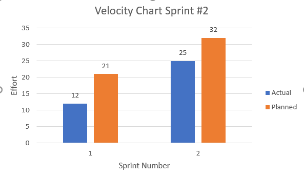

# Pomodoro App

## Vision

This app is for students and professionals to have a tool that will improve their time management skills.  This product will fit into the growing market need for productivity apps, that leads to better productivity and time management assisting with habits and self-control due to the pomodoro technique being a well established productivity method.  Unlike the other Pomodoro apps on the market, our app will offer a comprehensive stats tracking system that will be built into the app, and works well with the agile development process.

## Team Members

- [Ishaan Bhattacharya](https://github.com/ishaanb555)
- [Jordan Richards / thefinalstarman](https://github.com/thefinalstarman)
- [Kevin Perez](https://github.com/KaeWing)
- [Kimberly Szekely](https://github.com/KimberlySzekely)
- [Timothy Phillips](https://github.com/Timothy-Phillips)

## Links

[Trello Board](https://trello.com/b/ZoABS7mj)

[Design Document](artifacts/design.md)

[Tests](https://github.com/thefinalstarman/PomodoroApp/tree/main/project/app/src/test/java)

## Sprint 1

## Sprint 2

## Product Demonstration

")
