# Pomodoro App

## Vision

This app is for students and professionals to have a tool that will improve their time management skills.  This product will fit into the growing market need for productivity apps, that leads to better productivity and time management assisting with habits and self-control due to the pomodoro technique being a well established productivity method.  Unlike the other Pomodoro apps on the market, our app will offer a comprehensive stats tracking system that will be built into the app, and works well with the agile development process.

## Team Members

- [Ishaan Bhattacharya / ishaanb555](https://github.com/ishaanb555)
- [Jordan Richards / thefinalstarman](https://github.com/thefinalstarman)
- [Kevin Perez / KaeWing](https://github.com/KaeWing)
- [Kimberly Szekely / Kimberly Szekely](https://github.com/KimberlySzekely)
- [Timothy Phillips / Timothy-Phillips](https://github.com/Timothy-Phillips)

## Links

[Trello Board](https://trello.com/b/ZoABS7mj)

[Design Document](artifacts/design.md)

[Source Code](https://github.com/thefinalstarman/PomodoroApp/tree/main/project/app/src/main/java/org/team/app)

[Tests](https://github.com/thefinalstarman/PomodoroApp/tree/main/project/app/src/test/java)

[Manual Tests](artifacts/Manual_Test.md)

## Sprint 1

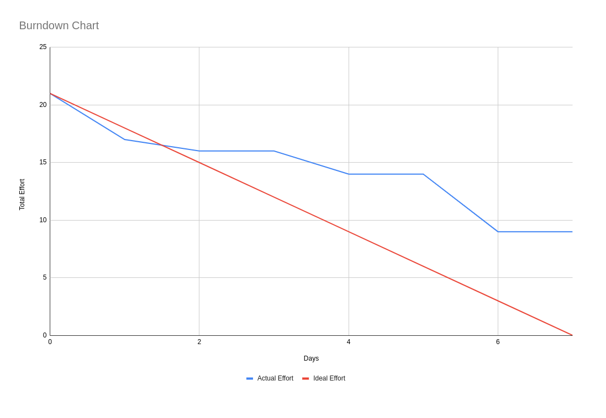

## Sprint 2

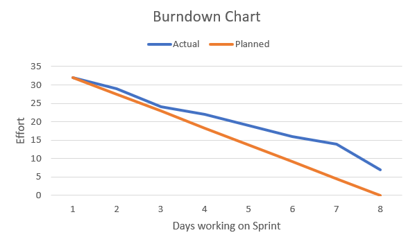

## Sprint 3
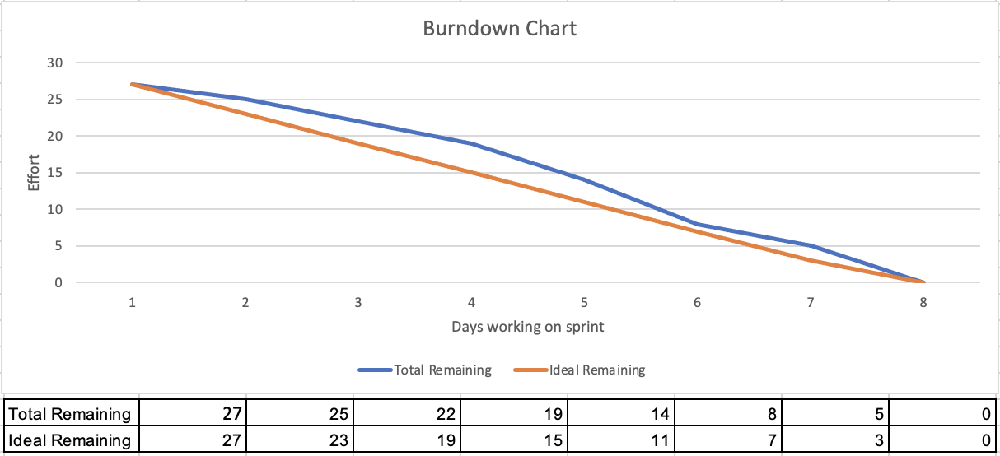
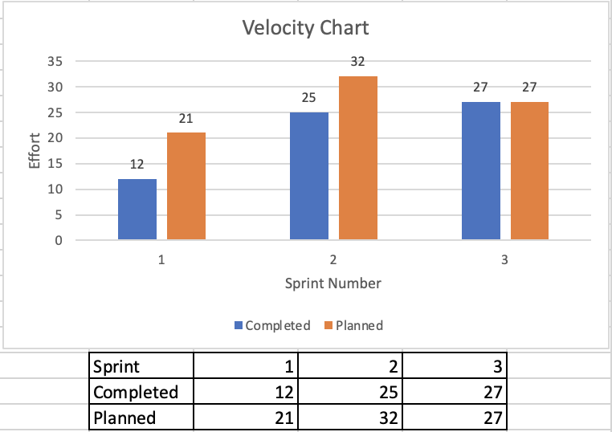

## Sprint 4
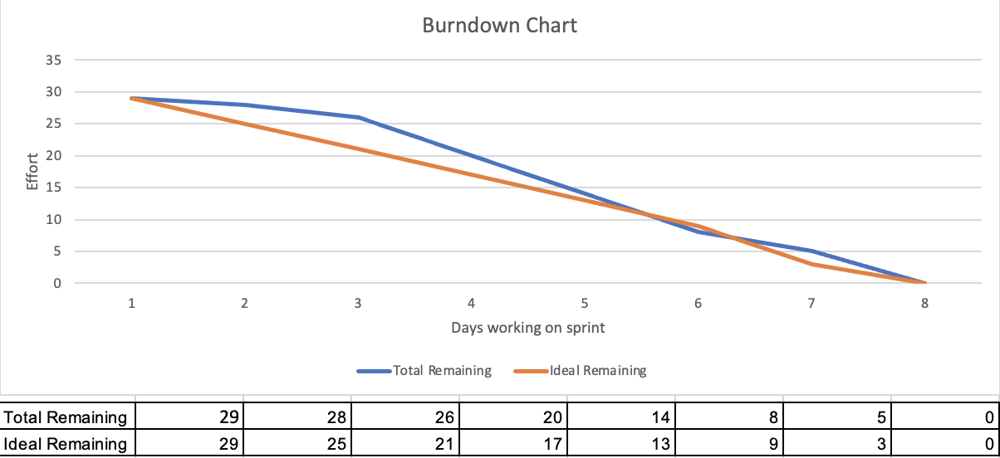
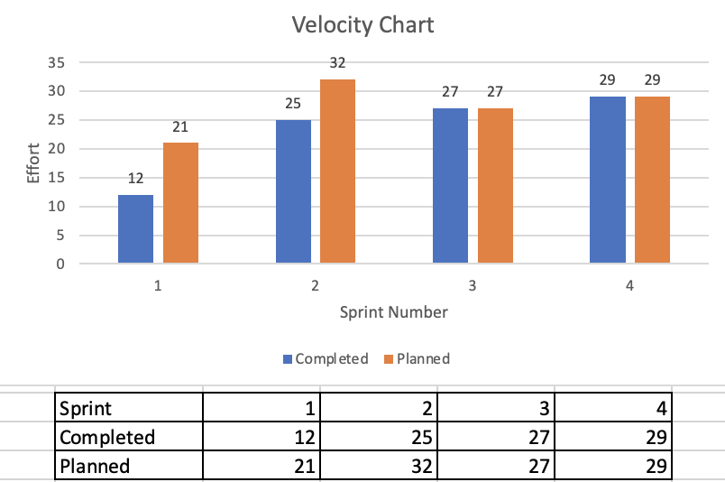

## Sprint 5
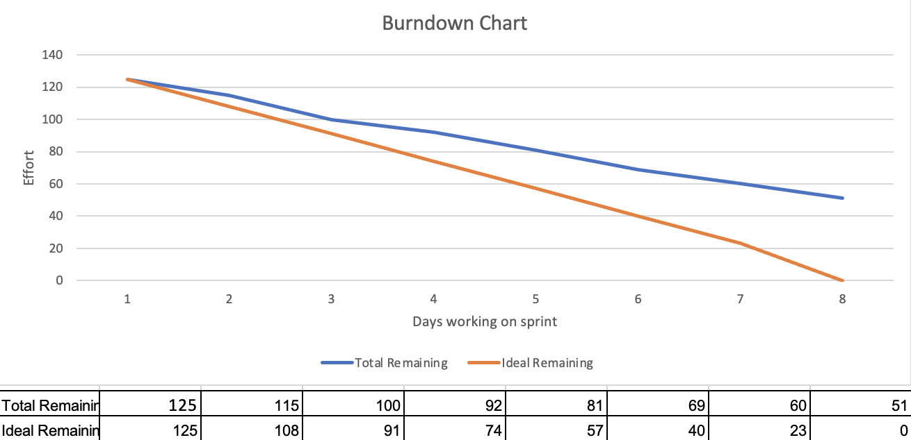
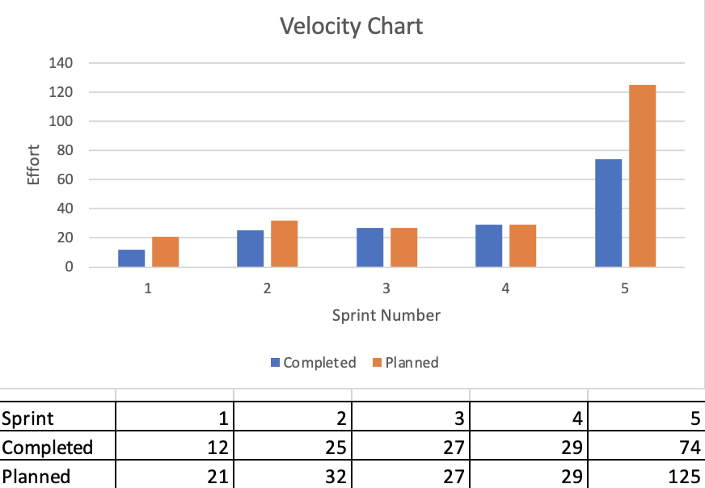

## Sprint 6
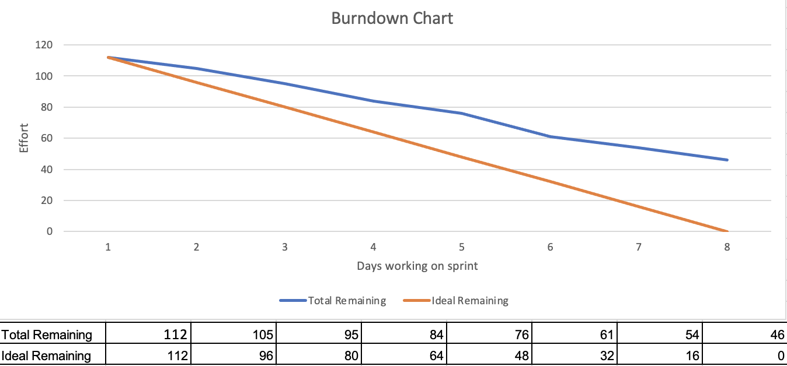
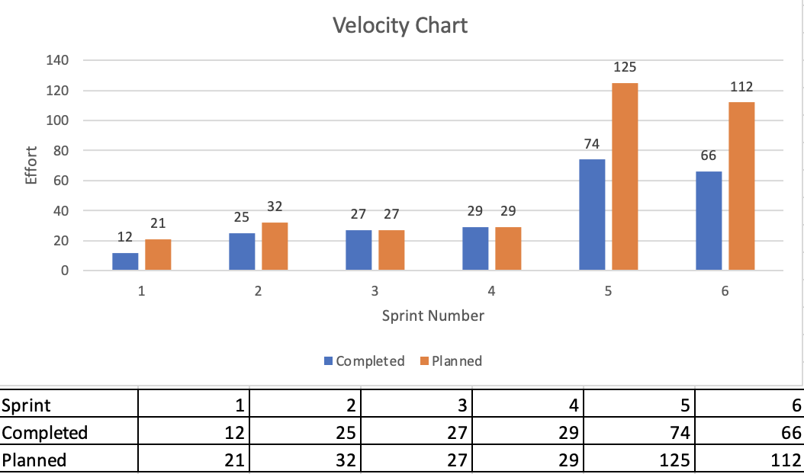

## Sprint 7
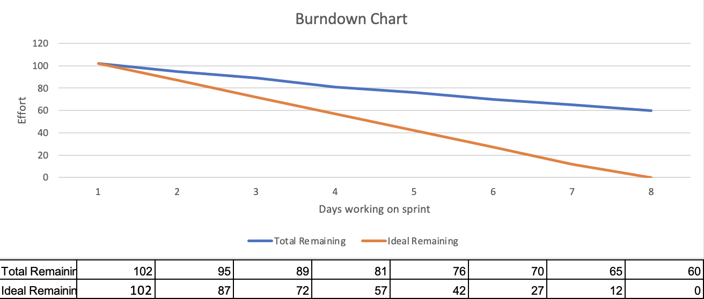
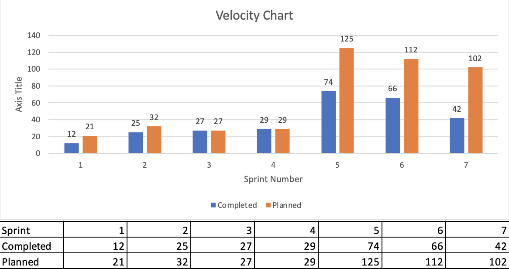

### Team Contribution
- [Ishaan Bhattacharya / ishaanb555](https://github.com/ishaanb555) - - Completed user story 003 having to do with the sign up page credentials being saved into a firebase realtime database, and the corresponding requirement testing 025 in the manual tests. also made 1/2 of the presentation video.
- [Jordan Richards / thefinalstarman](https://github.com/thefinalstarman) - - Finished up pause/skip button functionality for user story 007.
- [Kevin Perez / KaeWing](https://github.com/KaeWing) - - Worked on user story 011 and added a requirement for it. Connected notification system with 'Skip' button to be able to prove it works without having to wait the timer out.
- [Kimberly Szekely / Kimberly Szekely](https://github.com/KimberlySzekely) - - Continued user story 5 to match current implemented UI. Started user story 16 to have a dark mode that matched the currently implemented UI.
- [Timothy Phillips / Timothy-Phillips](https://github.com/Timothy-Phillips) - - Explored methods for integration with Google Calendar and Trello (User Story 004). Established framework for adjustable timers (User Story 006). Produced and edited demonstration videos.

## Product Demonstration
Part 1

Part 2

